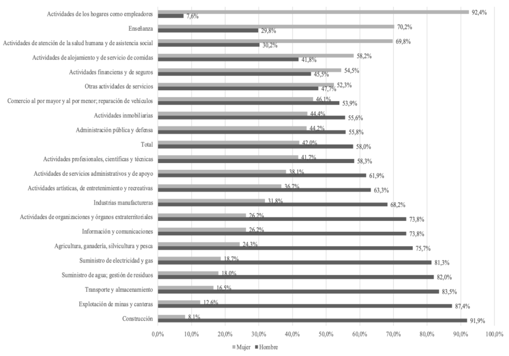
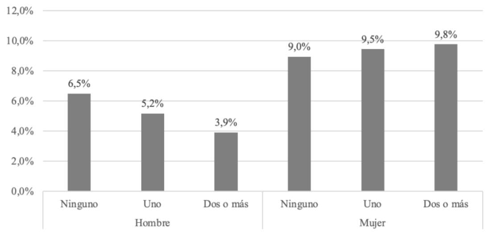

# Selección de artículo/reporte

Para la realización del primer reporte de reproducibilidad en el márgen del curso electivo de Ciencia Social Abierta, se selecciona el trabajo de @palma_desafiando_2025, titulado "Desafiando la segregación de género en el mercado laboral: Factores que inciden en las inserciones laborales atípicas en términos de género en Chile".

El trabajo de @palma_desafiando_2025 tiene por objetivo analizar los factores asociados a las inserciones laborales atípicas de género. Porque si bien en Chile la participación laboral femenina ha ido en aumento, aún persiste una fuerte segregación laboral, donde las mujeres tienden a ocuparse en labores de cuidado, salud y educación, mientras que los hombres tienen mayor presencia en sectores productivos como la minería y la construcción.

Así, se indaga en la mayor probabilidad que tienen las mujeres de insertarse en empleos atípicos respecto a los varones, fenómeno que se explicaría por los incentivos económicos y el reconocimiento social que ofrecen esos sectores masculinizados a las mujeres que deciden incursionar en ellos. En contraste, los hombres que se insertan en sectores feminizados enfrentan salarios más bajos y estigma social, lo que funciona como desincentivo en su incorporación a dichos espacios laborales.

Los resultados revelaron que el capital educativo y económico son factores que facilitan a las mujeres de mayores ingresos desafiar las barreras de género y acceder a empleos masculinizados. En el caso de los hombres, en cambio, un mayor nivel de ingresos y educación, junto con vivir en pareja o tener hijos, se establecen como factores que refuerzan la adherencia a roles tradicionales, frenando su incorporación a los sectores feminizados. En este sentido, el estudio concluye que, para alcanzar una equidad laboral real, se requiere impulsar políticas públicas que no solo apoyen la inserción de las mujeres en empleos no tradicionales, sino que también mejoren el prestigio social y las condiciones laborales de los trabajos feminizados, con el fin de incentivar una mayor participación masculina en dichos sectores.

# Justificación de la selección del artículo

Una de las razones por el cual se seleccionó el articulo de @palma_desafiando_2025, es porque utiliza como fuente de datos la encuesta CASEN 2022, la cual es una base de datos de acceso público (disponible en el sitio web del Ministerio de Desarrollo Social y Familia de Chile), cumpliendo así con uno de los criterios de la ciencia abierta, la disponibilidad de los datos. A esto se suma que el artículo presenta una metodología transparente, en la cual las decisiones metodológicas están explicitadas, lo que facilita su comprensión y eventual replicación. Además, la participación de una académica de la Universidad de Chile entre las autoras del trabajo permite establecer un canal de comunicación directo ante cualquier duda que pueda surgir en el proceso de replicación.

# Evaluación de reproducibilidad

- **Disponibilidad de datos**

Para evaluar el primer criterio de reproducibilidad, el artículo de @palma_desafiando_2025 menciona explícitamente que se usa como fuente de datos la encuesta CASEN 2022, la cual es una base de datos de acceso público, encontrándose disponible en el sitio web del [Ministerio de Desarrollo Social y Familia de Chile](https://observatorio.ministeriodesarrollosocial.gob.cl/encuesta-casen). Por lo que no supuso una dificultad muy grande para el ejercicio. Sin embargo, la fuente de datos de la CASEN es muy extensa, por lo que hubo algunas dificultades para cargarla en **R**, por lo que se optó por seleccionar únicamente las variables necesarias para la construcción de las figuras seleccionadas.

- **Disponibilidad de código**

En cuanto al segundo criterio de reproducibilidad, @palma_desafiando_2025 no presenta explícitamente el código utilizado para la creación de figuras. Ante esto, se contactó a una de las autoras del trabajo, quien si bien no proporcionó el código, ofreció asesoría sobre cómo replicar las figuras seleccionadas. Aquello, sumado a la metodología del texto, permitió orientar el proceso y llevar a cabo la replicación.

- **Documentación**

Para el tercer criterio de reproducibilidad, el artículo de @palma_desafiando_2025 presenta una metodología clara, en la cual se explicitan las decisiones metodológicas tomadas, lo que facilita su comprensión. Sin embargo, no se presentan detalles específicos sobre los códigos utilizados para la creación de las figuras, lo que podría dificultar la replicación exacta de las figuras.

- **Transparencia**

Por último, y para el cuarto criterio de reproducibilidad, @palma_desafiando_2025 no presenta información explícita sobre posibles conflictos de interés. Sin embargo, si menciona que el estudio fue financiado por la Agencia Nacional de Investigación y Desarrollo ([ANID](https://anid.cl/)), lo que aporta a la transparencia de la investigación.

# Análisis reproducible

## Resultado a reproducir

Se seleccionó para la reproducción la **Figura 2** de @palma_desafiando_2025, la cual corresponden a un gráfico de la segregación género en el mercado laboral {#fig-2}

Además se seleccionó la **Figura 5** de @palma_desafiando_2025, gráfico de personas de 15 años y más ocupadas en empleos atípicos según sexo y número de hijos menores de cinco años, respectivamente. {#fig-5}

## Proceso de reproducción

### Procesamiento

#### Carga de paquetes

En primer lugar, se cargan los paquetes `dplyr`, `haven`,`readr` y `ggplot2` en su versión utilizada para el ejercicio de reproducción. Esto es posible gracias al paquete `renv`, el cual permite gestionar las dependencias de R y asegurar que se utilicen las mismas versiones de los paquetes que se usaron originalmente para el análisis.

Si es la primera vez que se ejecuta el código, es necesario inicializar el entorno de `renv` con `renv::init()`. En sesiones posteriores, se debe ejecutar `renv::restore()` para restaurar el entorno con las versiones de los paquetes utilizadas originalmente.

```{r}
#| results: false
#| message: false
#| warning: false
install.packages("renv")
# Ejecutar solo la primera vez para inicializas
renv::init() 

#Ejecutar en sesiones siguientes para restaurar el entorno
renv::restore()

# Cargar librerías necesarias
library(dplyr)
library(haven)
library(ggplot2)
library(readr)
library(here)
library(scales)
```

#### Carga de base de datos

A continuación, se carga la base de datos original utilizada en @palma_desafiando_2025, la cual se encuentra clickeando [aquí](https://zenodo.org/records/19892581/files/casen_2022.RData) o visitando la página oficial de [CASEN](https://observatorio.ministeriodesarrollosocial.gob.cl/encuesta-casen-2022)

La base de datos, al tener un tamaño de 1,5GB, no es posible importarla a **GitHub**. Es por esto, que primeramente se debe cargar la base de datos en *input/data/original* desde el repositorio local. Posteriormente, se seleccionan las variables necesarias utilizando la función `select()` del paquete `dplyr` para guardar la nueva de base de datos procesada en *input/data/proc*, función realizada con el paquete `here`.

```{r}
#Se carga base de datos CASEN desde local

#load("input/data/original/casen_2022.RData")
# Seleccionar variables necesarias para reproducir el resultado
#proc_casen22 <- casen_2022 %>% select(sexo, pco2, activ, folio, nucleo, edad, rama1, rama4,expr)
#Se guarda base de datos procesada
#saveRDS(proc_casen22, 
#  here("input", "data", "proc", "proc_casen22.rds"), compress = FALSE)

```

Ya teniendo la base de datos procesada en *input/data/proc* podemos reproducir la **Figura 2** y la **Figura 5** de @palma_desafiando_2025

#### Figura 2

Para reproducir la **Figura 2** de @palma_desafiando_2025, primeramente se deben seleccionar las siguientes variables:

- **"rama1"**: variable que indica la rama de actividad económica a la que se dedica la persona, codificada según la clasificación CIIU a 1 dígito.

- **"sexo"**: variable que indica el sexo de la persona, codificada como 1 para hombres y 2 para mujeres.

- **"activ"**: variable que indica la condición de actividad de la persona, codificada como 1 para ocupados, 2 para desocupados y 3 para inactivos.

```{r}
datos <- readRDS("input/data/proc/proc_casen22.rds")
#Seleccionar variables y filtrar
datos <- datos %>%
  filter(activ == 1)

datos <- datos %>% select(rama1, sexo, activ) 


#recodificación.
datos <- datos %>% mutate(ocupacion = case_when(
  rama1 == 1  ~ "Agricultura, ganadería, silvicultura y pesca",
  rama1 == 2  ~ "Explotación de minas y canteras",
  rama1 == 3 ~ "Industrias Manufactureras",			
  rama1 == 4 ~ "Suministro de Electricidad y Gas",			
  rama1 == 5 ~ "Suministro de Agua; gestión de residuos",			
  rama1 == 6 ~ "Construcción",		
  rama1 == 7 ~ "Comercio al Por Mayor y al Por Menor; Reparación de Vehículos",			
  rama1 == 8 ~ "Transporte y Almacenamiento",			
  rama1 == 9 ~ "Actividades de Alojamiento y de Servicio de Comidas",			
  rama1 == 10 ~ "Información y Comunicaciones",			
  rama1 == 11 ~ "Actividades Financieras y de Seguros",			
  rama1 == 12 ~ "Actividades Inmobiliarias",			
  rama1 == 13 ~ "Actividades Profesionales, Científicas y Técnicas",			
  rama1 == 14 ~ "Actividades de Servicios Administrativos y de Apoyo",			
  rama1 == 15 ~ "Administración Pública y Defensa",			
  rama1 == 16 ~ "Enseñanza",			
  rama1 == 17 ~ "Actividades de Atención de la Salud Humana y de Asistencia Social",			
  rama1 == 18 ~ "Actividades Artísticas, de Entretenimiento y Recreativas",			
  rama1 == 19 ~ "Otras Actividades de Servicios",			
  rama1 == 20 ~ "Actividades de los Hogares como Empleadores",			
  rama1 == 21 ~ "Actividades de Organizaciones y Órganos Extraterritoriales",			
  rama1 == 98 ~ NA,			
  rama1 == 99 ~ NA			
))

```

Para esta figura, se seleccionan únicamente las personas ocupadas y se recodifican las ocupaciones según la CIIU asignando etiquetas de género "Hombre y Mujer" para el análisis segregado de ocupaciones.

``` {r}

datos <- datos %>%
  filter(!is.na(ocupacion))
datos <- datos %>%
  filter(!is.na(activ))

datos <- datos %>% mutate(sexo = case_when(
  sexo == 1 ~ "Hombre",
  sexo == 2 ~ "Mujer",
  
))

#porcentaje de ocupación por sexo
ocu_s <- datos %>%
  group_by(ocupacion, sexo) %>%
  summarise(n = n(), .groups = "drop") %>%
  group_by(ocupacion) %>%
  mutate(porcentaje = n / sum(n) * 100)

#porcentaje total de segregación
c_total <- datos %>%
  filter(activ == 1) %>%
  group_by(sexo) %>%
  summarise(n = n(), .groups = "drop") %>%
  mutate(
    porcentaje = n / sum(n) * 100
  )

#se unen ambos
graf1 <- bind_rows(ocu_s, c_total)

#recodificar
graf1 <- graf1 %>%
  mutate(ocupacion = ifelse(is.na(ocupacion), "Total", ocupacion))

#orden de mayor participación fem a menor
orden <- graf1 %>%
  filter(sexo == "Mujer") %>%  # ajusta según el valor exacto de la variable
  arrange(porcentaje) %>%
  pull(ocupacion)

graf1 <- graf1 %>%
  mutate(ocupacion = factor(ocupacion, levels = orden))

```

Junto a esto, se filtran los datos perdidos y se recodifican la variable **sexo** para calcular los porcentajes de personas hombres y mujeres según ocupación junto al porcentaje total de a nivel país para un posterior punto de referencia en el gráfico. Se combinan ambas tablas y se define el orden de las ocupaciones en el eje Y, basandose en la participación femenina (de menor a mayor).

#### Figura 5

Para reproducir la **Figura 5** de @palma_desafiando_2025, primeramente se deben seleccionar las siguientes variables:

- **"sexo"**: variable que indica el sexo de la persona, codificada como 1 para hombres y 2 para mujeres.

- **"pco2"**: variable que indica la relación de parentesco con el jefe de hogar, donde los códigos 4, 5 y 6 corresponden a hijos/as.

- **"activ"**: variable que indica la condición de actividad de la persona, codificada como 1 para ocupados, 2 para desocupados y 3 para inactivos.

- "**folio" y "nucleo"**: variables que identifican el hogar y el núcleo familiar, respectivamente.

- **"edad"**: variable que indica la edad de la persona.

- **"rama4"**: variable que indica la rama de actividad económica a la que se dedica la persona, codificada según la clasificación CIIU a 4 dígitos.

- **"expr"**: variable que indica la expansión o peso de la persona en la muestra, utilizada para obtener estimaciones representativas a nivel nacional.

```{r}
#| results: false
#| message: false
#| warning: false
proc_casen22 <- readRDS("input/data/proc/proc_casen22.rds")

#seleccion y limpieza
proc_casen22 <-proc_casen22 |>
  select(sexo, pco2, activ, folio, nucleo, edad, rama4, expr) |>
  mutate(
    rama4 = as.numeric(rama4),
    rama4 = if_else(rama4 %in% c(-99, -88, -66), NA_real_, rama4)
  ) |>
  filter(
    !is.na(sexo),
    !is.na(edad),
    !is.na(pco2))


```

Después de seleccionar las variables necesarias, se crean nuevas variables para identificar a los hijos menores de 5 años. Para esto, se utiliza la variable **"pco2"** para identificar a los hijos/as (códigos 4, 5 y 6) y luego se filtran aquellos que tienen una edad menor o igual a 5 años. Posteriormente, se agrupan los datos por "folio" y **"nucleo"** para calcular el número total de hijos menores de 5 años en cada hogar, y se crea una nueva variable categórica que clasifica a los hogares según el número de hijos menores de 5 años (ninguno, uno o dos o más).

```{r}
#| results: false
#| message: false
#| warning: false
#crear hijos menores de 5 años
proc_casen22 <- proc_casen22 |>
  mutate(
    hijo = as.integer(pco2 %in% c(4, 5, 6)),
    hijos5 = as.integer(hijo == 1 & edad <= 5)) |>
  group_by(folio, nucleo) |>
  mutate(n_hijos5 = sum(hijos5, na.rm = TRUE)) |>
  ungroup() |>
  mutate(
    cat_hijos5 = factor(
      case_when(
        n_hijos5 == 0 ~ "Ninguno",
        n_hijos5 == 1 ~ "Uno",
        n_hijos5 >= 2 ~ "Dos o más",
        TRUE ~ NA_character_
      ),
      levels = c("Ninguno", "Uno", "Dos o más")))
```

Además, se crea una submuestra de personas ocupadas (mayores de 15 años y activos) para analizar la inserción laboral atípica según rama de actividad económica. Para esto, se filtran los datos para incluir solo a las personas que se encuentran ocupadas **(activ == 1)**, mayores de 15 años y que no tienen datos perdidos en la variable **"rama4"**. Luego, se calcula el porcentaje de mujeres en cada rama de actividad económica para clasificar las ramas como feminizadas, masculinizadas o mixtas. Finalmente, se identifica a las personas que se encuentran en empleos atípicos según su sexo y la rama de actividad económica en la que trabajan.

```{r}
#| results: false
#| message: false
#| warning: false
#submuestra ocupados (mayor de 15 años y activos)
ocupados <- proc_casen22 |>
  filter(activ == 1, edad >= 15, !is.na(rama4))

# indice de masculinizacion o feminizacion por rama
fem_rama4 <- ocupados |>
  group_by(rama4) |>
  summarise(
    n_mujeres = sum(expr[sexo == 2], na.rm = TRUE),
    n_total   = sum(expr, na.rm = TRUE),
    pct_mujer = 100 * n_mujeres / n_total,
    .groups   = "drop"
  ) |>
  mutate(
    tipo_rama = case_when(
      pct_mujer >= 70 ~ "Feminizada",
      pct_mujer <= 30 ~ "Masculinizada",
      TRUE ~ "Mixta"))
```

Posteriormente, se realiza la inserción atípica, identificando a las personas que se encuentran en empleos atípicos según su sexo y la rama de actividad económica en la que trabajan. Para esto, se hace un `left join` entre la base de datos de ocupados y la clasificación de ramas feminizadas, masculinizadas o mixtas. Luego, se crea una nueva variable "atipico" que indica si una persona se encuentra en un empleo atípico (1) o no (0) según su sexo y el tipo de rama en la que trabaja. Finalmente, se crea la variable `sexo_label`para facilitar la interpretación de los resultados.

```{r}
#| message: false
#| warning: false
#insercion atipica
ocupados <- ocupados |>
  left_join(select(fem_rama4, rama4, tipo_rama), by = "rama4") |>
  mutate(
    atipico = as.integer(
      (sexo == 2 & tipo_rama == "Masculinizada") |
      (sexo == 1 & tipo_rama == "Feminizada")
    ),
    sexo_label = factor(sexo, levels = c(1, 2), labels = c("Hombre", "Mujer")))

# datos para recrear figura 5
fig5_data <- ocupados |>
  group_by(sexo_label, cat_hijos5) |>
  summarise(
    pct = 100 * sum(expr[atipico == 1], na.rm = TRUE) / sum(expr, na.rm = TRUE),
    .groups = "drop"
  ) |>
  mutate(
    x_grupo = factor(
      paste(sexo_label, cat_hijos5, sep = "_"),
      levels = c(
        "Hombre_Ninguno", "Hombre_Uno", "Hombre_Dos o más",
        "Mujer_Ninguno", "Mujer_Uno", "Mujer_Dos o más")))

print(fig5_data)
```

### Reproducción

#### Figura 2

La visualización de la **Figura 2** se realiza a través de `ggplot2` para construir un gráfico de barras horizontales esquematizados. Se usa `geom_bar` con `position = "dodge"` para mostrar las barras de hombres y mujeres una al lado de la otra por cada categoría. Se añaden etiquetas de texto sobre las barras que muestran el porcentaje con un decimal, ajustadas con `hjust = -0.1` para que no se superpongan con la barra. El eje X se configura para mostrar marcas cada 10% (de 0% a 100%) y finalmente se aplican colores en escala de grises según la figura a reproducir. Se guarda en formato PNG en la ruta *output/graphs/figura2_palmaetal2025.png* con una resolución de 300 dpi y un fondo blanco para asegurar la calidad de la imagen.

```{r}
#| label: fig-2-rep
#| fig-cap: "Figura 2 replicada"


#grafico
p_fig2 <- ggplot(graf1, aes(x = porcentaje, y = ocupacion, fill = sexo)) +
  geom_bar(stat = "identity", position = "dodge") +
  geom_text(
    aes(label = paste0(round(porcentaje, 1), "%")),
    position = position_dodge(width = 0.8),
    hjust = -0.1,
    size = 3
  ) +
  scale_fill_manual(values = c("Hombre" = "#404040", "Mujer" = "#A0A0A0")) +
  scale_x_continuous(
    labels = scales::percent_format(scale = 1),
    limits = c(0, 110),
    breaks = seq(0, 100, by = 10)
  ) +
  labs(x = NULL, y = NULL, fill = NULL) +
  theme_minimal() +
  theme(
    legend.position = "bottom",
    panel.grid.major.y = element_blank(),
    panel.grid.minor = element_blank(),
    axis.text.y = element_text(size = 9),
    axis.text.x = element_text(size = 9))

ggsave(
  filename = "output/graphs/figura2_palmaetal2025.png",
  plot = p_fig2,
  width = 8,
  height = 6,
  dpi = 300,
  bg = "white")
print(p_fig2)
```

#### Figura 5

Por último, se construye el gráfico de barras para la **Figura 5** utilizando `ggplot2`. Se utiliza `geom_col` para crear las barras, y `geom_text` para añadir etiquetas con los porcentajes sobre cada barra. El eje X se personaliza para mostrar las categorías de sexo y número de hijos menores de 5 años, mientras que el eje Y se configura para mostrar porcentajes con un formato adecuado. Además, se añaden anotaciones para indicar claramente las categorías de hombres y mujeres, y se ajustan los márgenes del gráfico para evitar que las etiquetas se corten. Se guarda en formato PNG en la ruta *output/graphs/figura5_palmaetal2025.png* con una resolución de 300 dpi y un fondo blanco para asegurar la calidad de la imagen.

```{r}
#| label: fig-5-rep
#| fig-cap: "Figura 5 replicada"
#| message: false
#| warning: false
#grafico figura 5
p_fig5 <- ggplot(fig5_data, aes(x = x_grupo, y = pct)) +
  geom_col(fill = "#595959", width = 0.4) +
  geom_text(aes(label = sprintf("%.1f%%", pct)), vjust = -0.5, size = 3.5) +
  scale_x_discrete(labels = c(
    "Hombre_Ninguno" = "Ninguno",
    "Hombre_Uno" = "Uno Hombre",
    "Hombre_Dos o más" = "Dos o más",
    "Mujer_Ninguno" = "Ninguno",
    "Mujer_Uno" = "Uno Mujer",
    "Mujer_Dos o más" = "Dos o más"
  )) +
  scale_y_continuous(
    limits = c(0, 14),
    breaks = seq(0, 12, by = 2),
    labels = label_percent(scale = 1)
  ) +
  annotate("text", x = 2, y = -1.8, label = "Hombre", size = 3.8) +
  annotate("text", x = 5, y = -1.8, label = "Mujer", size = 3.8) +
  coord_cartesian(clip = "off") +
  labs(
    title = "Figura 5. Personas de 15 años y más ocupadas en empleos atípicos según sexo y número de\nhijos menores de 5 años",
    x = NULL,
    y = NULL,
    caption = "Fuente: Procesamientos propios, Encuesta CASEN 2022"
  ) +
  theme_minimal(base_size = 12) +
  theme(
    plot.title = element_text(size = 10, hjust = 0),
    plot.caption = element_text(face = "italic", hjust = 0),
    plot.margin = margin(10, 10, 35, 10),
    panel.grid.major.x = element_blank(),
    panel.grid.minor = element_blank())

print(p_fig5)
#guardar en output&
ggsave(
  filename = "output/graphs/figura5_palmaetal2025.png",
  plot = p_fig5,
  width = 8,
  height = 6,
  dpi = 300,
  bg = "white"
)
```

# Conclusiones

El artículo de @palma_desafiando_2025 se construye a partir de una base de datos de acceso público, lo que representa un punto positivo en términos de reproducibilidad, dado que cualquier investigador puede acceder a la misma fuente. Además, cuenta con una metodología detallada que facilita la comprensión del proceso analítico. Sin embargo, la ausencia del código utilizado dificulta la replicación exacta de las figuras y sus resultados. Si bien fue posible replicarlas, los valores obtenidos no son idénticos a los del artículo original, diferencia que podría explicarse por algún procedimiento de procesamiento de la base de datos que no queda explicitado en el texto y que, por tanto, fue omitido durante el ejercicio de replicación. Por ello, se enfatiza la importancia de publicar de forma abierta los códigos empleados en cada investigación, como una práctica fundamental para garantizar una reproducibilidad plena. Ya que en algunos casos cambian los análisis, por ejemplo …

Comentar tambien que en algunos casos, las figuras cambiaron de manera que su analisis se puede ver afectado, por ejemplo, en el caso de la  @fig-2-rep , si bien se observan diferencias puntuales en algunos valores, la tendencia general de la figura se mantiene de manera casi intacta con respecto a la figura 2 original. En cambio, en la @fig-5-rep las diferencias son más significativas, ya que afecta la distribución de los datos en la figura. En la réplica, las categoría femeninas "Uno Mujer" (13,1%) supera a "Dos o más" (11%), rompiendo la tendencia ascendente que presenta la figura original, donde el porcentaje más alto corresponde a la categoría de mujeres con “dos o más hijos” (9,8%), seguido de quienes tienen uno (9,5%) y “ninguno” (9,0%). Así obteniendo un resultado que puede ser interpretado de manera diferente. Por ello, se enfatiza la importancia de publicar de forma abierta los códigos empleados en cada investigación, como una práctica fundamental para garantizar una reproducibilidad plena.

# Recomendaciones

Si bien el ejercicio de replicabilidad resultó más nutritivo al desarrollar los códigos autónomamente, en materia de reproducibilidad lo ideal sería que los artículos proporcionaran tanto los códigos utilizados para el procesamiento de datos como los de la construcción de figuras, pues proporcionar el código agiliza el proceso de replicación, permitiendo que personas con menor manejo en softwares estadísticos puedan reproducir el estudio también. Además, la publicación de los códigos junto a los datos y la metodología detallada fortalece la transparencia y la confianza en la investigación, al permitir que otros investigadores puedan verificar y validar los resultados de manera más eficiente. Sin embargo, el texto de @palma_desafiando_2025 es explícito en cuanto a la metodología utilizada, lo que facilita la comprensión del proceso analítico. Aun así, la falta de código dificulta la reproducción exacta de las figuras y sus resultados, lo que resalta la importancia de publicar de forma abierta los códigos empleados en cada investigación para garantizar una reproducibilidad plena.

Por lo tanto, se recomienda que los artículos científicos incluyan no solo los datos utilizados sino también los códigos empleados para el análisis y la generación de resultados, como una práctica estándar para promover la reproducibilidad y la transparencia en la investigación científica. Esto no solo beneficiaría a la comunidad científica, sino que también contribuiría a la democratización del conocimiento, permitiendo que un público más amplio pueda acceder y comprender los procesos detrás de los hallazgos científicos.

# Referencias

::: {#refs}
:::

# Apéndice

## Código

Al no estar disponible el código original, se presenta el código desarrollado para la reproducción de las figuras seleccionadas. Este código se encuentra organizado en secciones correspondientes a cada figura, con comentarios que explican cada paso del proceso.